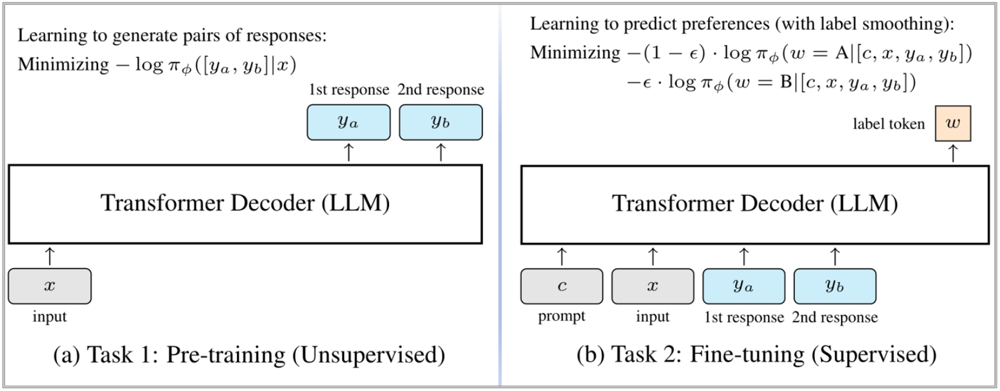

<!-- <div align="center">
  <h1>A Generative Foundation Reward Model for Reward Generalization</h1>
  <p align="center" dir="auto">
  <a href="https://"> 【Paper】 📝 </a> |
  <a href="https://"> 【Models】 🤗 </a>
  </p>
</div> -->

# A Generative Foundation Reward Model (GRAM)

This repository contains the code and released models for our paper [GRAM: A Generative Foundation Reward Model for Reward Generalization 📝](). We propose a more effective approach to reward model training by combining both labeled and unlabeled data. Our method introduces a generative reward model that first learns from a large corpus of unlabeled data and is then fine-tuned with supervised data. Please find all the released model checkpoints at [this link 🤗]().

</img>


## 🆕 Changelog


## 🔗 Quick Links
* [GRAM: A Generative Foundation Reward Model for Reward Generalization](#a-generative-foundation-reward-model-gram)

  * [Changelog](#changelog)
  * [Released Models](#released-models)
  * [Installation Guide](#installation)
  * [Preparing Models and Datasets](#preparing-models-and-datasets)
  * [Training Scripts](#training-scripts)
  * [Using GRAM in RLHF](#how-to-use-gram-in-rlhf)
  * [Citation](#citation)


---

## Released Models

| Model | Model Size |
|-------|------------|
| | |

## Installation Guide

The code of this repo is modified from [hiyouga/LLaMA-Factory](https://github.com/hiyouga/LLaMA-Factory).

```bash
git clone --depth 1 https://gitee.com/wangclnlp/gram
cd gram
pip install -e ".[torch,metrics]" --no-build-isolation
```

## Preparing Models and Datasets

### Models

ANY Generative Large Language Model is supported.

### Datasets

#### Pre-Training

Each item of the dataset for GRAM pre-training should include at least two keys:

- `instruction`: any prompt in following template:
  ```text
  [User Question]
  {your prompt here}
  ```
- `input`: the input for above prompt, can be empty if there is not.
- `output`: two responses in following template:
  ```text
  [The Start of Assistant A's Answer]
  {answer of assistant A}
  [The End of Assistant A's Answer]

  [The Start of Assistant B's Answer]
  {answer of assistant B}
  [The End of Assistant B's Answer]
  ```

An example in json format:

```json
[
  {
    "instruction": "[User Question]\nCan dogs get covid?\n\n",
    "input": "",
    "output": "[The Start of Assistant A's Answer]\nYes, indeed. ... [The End of Assistant A's Answer]\n\n[The Start of Assistant B's Answer]\nMany of the symptoms are similar, including fever, coughing, loss of smell, etc. ...\n[The End of Assistant B's Answer]"
  },
  ...
]
```


#### Fine-Tuning

Each item of the dataset for GRAM fine-tuning should include at least two keys:

- `instruction`: any prompt with corresponding two responses in following template:
  ```text
  Please act as an impartial judge and evaluate the quality of the responses provided by two AI assistants to the user question displayed below. You should choose the assistant that follows the user's instructions and answers the user's question better.
  Your evaluation should consider factors such as the helpfulness, relevance, accuracy, depth, creativity, and level of detail of their responses. Avoid any position biases and ensure that the order in which the responses were presented does not influence your decision. Do not allow the length of the responses to influence your evaluation. Do not favor certain names of the assistants. Be as objective as possible.
  Please directly output your final verdict by strictly following this format: "A" if assistant A is better, "B" if assistant B is better.

  [User Question]
  {your prompt here}

  [The Start of Assistant A's Answer]
  {answer of assistant A}
  [The End of Assistant A's Answer]

  [The Start of Assistant B's Answer]
  {answer of assistant B}
  [The End of Assistant B's Answer]

  #Preferred:
  ```
- `input`: leave it empty.
- `output`: the correct option, "A" or "B".

An example in json format:

```json
[
  {
    "instruction": "Please act as an impartial judge and evaluate the quality of the responses provided by two AI assistants to the user question displayed below. ... [User Question]... [The Start of Assistant A's Answer] ... [The Start of Assistant B's Answer] ...",
    "input": "",
    "output": "B"
  },
  ...
]
```


#### Note
> After pre-processing the datasets as above, DO NOT forget to register the dataset in [`data/dataset_info.json`](data/dataset_info.json).
> Example:
> ```json
>  {
>    ...,
>    "dataset_name": {
>      "file_name": "/path/to/your/dataset"
>    },
>    ...,
>  },
> ```


## Training Scripts

### Pre-Training

```bash
llamafactory-cli train examples/train_full/qwen3_pre_training_rm.yaml
```

### Fine-Tuning

```bash
llamafactory-cli train examples/train_full/qwen3_pre_training_ft.yaml
```

### Evaluation

The evaluation scripts are in the subdirectory `evaluation/`:
```bash
cd evaluation/
ckpt_path=/path/to/your/model
```

- Evaluation with Rewardbench

  ```bash
  python gram_eval.py -i allenai_reward_bench/filtered.json -m $ckpt_path -o $ckpt_path/reward-bench.res
  echo -e "RewardBench Evaluation Summary:\n"
  python get_reward_bench_score.py $ckpt_path/reward-bench.res
  ```

- Evaluation with Judgebench
  ```bash
  python gram_eval.py -i scalerlab_judgebench/gpt.json -m $ckpt_path -o $ckpt_path/judge-bench.res
  echo -e "JudgeBench Evaluation Summary:\n"
  python get_judgebench_score.py $ckpt_path/judge-bench.res
  ```

- Evaluation with RM-Bench
  ```bash
  python gram_eval.py -i thu_keg_rm_bench/total_dataset.json -m $ckpt_path -o $ckpt_path/reward-bench.res
  echo -e "RM-bench Evaluation Summary:\n"
  python get_reward_bench_score.py $ckpt_path/reward-bench.res
  ```

## Using GRAM in RLHF


## Citation
