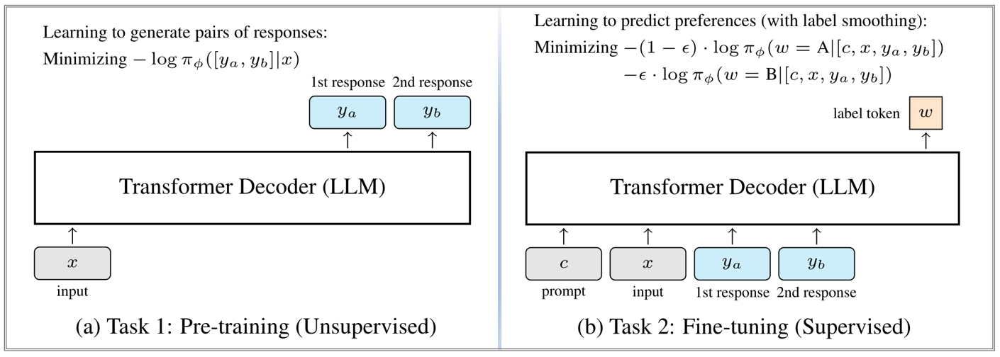

<!-- 

  <h1>A Generative Foundation Reward Model for Reward Generalization</h1>
  

  <a href="https://"> 【Paper】 📝 </a> | 
  <a href="https://"> 【Models】 🤗 </a> 
  

 -->

# A Generative Foundation Reward Model (GRAM)

This repository contains the code and released models for our paper [GRAM: A Generative Foundation Reward Model for Reward Generalization 📝](). We propose a more effective approach to reward model training by combining both labeled and unlabeled data. Our method introduces a generative reward model that first learns from a large corpus of unlabeled data and is then fine-tuned with supervised data. Please find all the released model checkpoints at [this link 🤗]().

</img>

## 🆕 Changelog

## 🔗 Quick Links
- [GRAM: A Generative Foundation Reward Model for Reward Generalization](#a-generative-foundation-reward-model-GRAM)
  <!-- - [Changelog](#-changelog)
  - [Tips for Running SimPO](#tips-for-running-simpo)
  - [Released Models](#released-models)
  - [Install Requirements](#install-requirements)
  - [Training scripts](#training-scripts)
  - [Evaluation](#evaluation)
  - [Bugs or Questions?](#bugs-or-questions)
  - [Citation](#citation) -->
